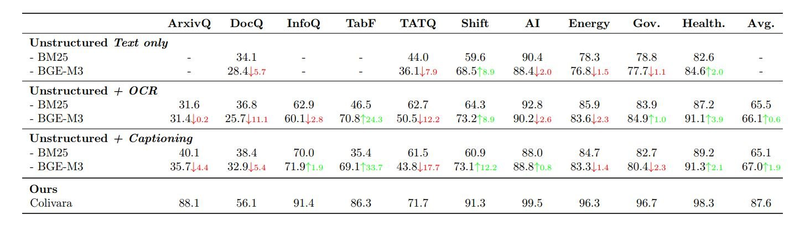
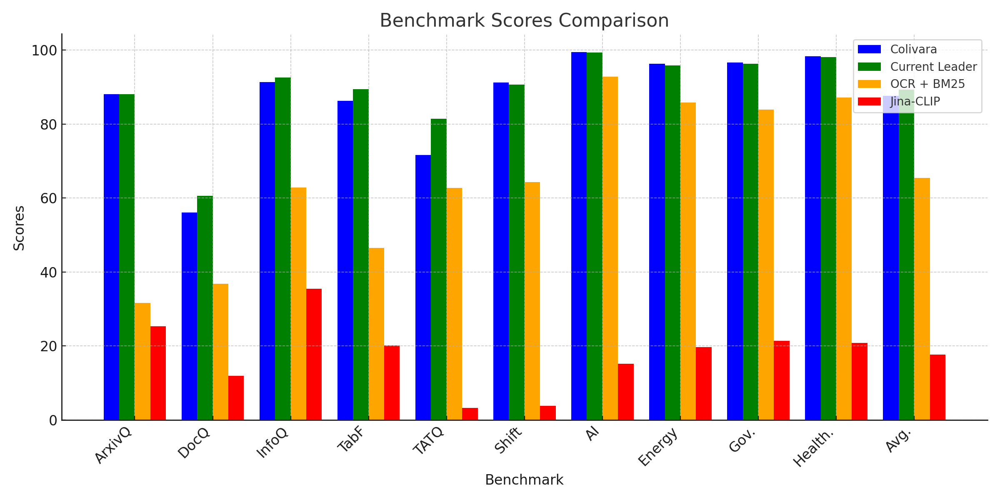

# ColiVara Benchmark Evaluation

## Overview

Colivara stands out as a practical, user-focused tool that combines state-of-the-art technology with real-world adaptability. Built on the colqwen2 model, Colivara is optimized for operational environments, offering reliable, scalable, and actionable insights. Benchmark comparisons show ColiVara is markedly better than current methods for data extraction and query generation from documents.&#x20;

Whether dealing with raw text, OCR-enhanced data, or captioned inputs, Colivara consistently outperforms by a wide margin. When compared to the top research models on the ViDoRe benchmark, ColiVara results stay competitive.

<figure><figcaption>
NDCG@5 scores comparison of ColiVara and Traditional Unstructured Methods
</figcaption></figure>

Our comparisons are done using the systems’ **NDCG@5** score, which is the standard used by the ViDoRe benchmark. _Normalized Discounted Cumulative Gain at rank 5_ evaluates how a retrieval model delivers relevant results to a query. NDCG gives higher importance to results that are both relevant and appear at the top of the list. It focuses on the quality of the top 5 results, which are usually the most important to users

<figure><figcaption></figcaption></figure>

***

## ViDoRe

We are measuring our data using the <mark style="color:purple;">**ViDoRe Benchmark**</mark>, which was introduced alongside the [**ColPali model**](colpali-architecture.md). The benchmark serves as a platform to evaluate and compare different retrieval models, highlighting the importance of visual elements in document understanding and retrieval


**ViDoRe**, short for Visual Document Retrieval Benchmark, is a comprehensive evaluation framework designed to assess the performance of retrieval systems in matching user queries to relevant document pages. It emphasizes the integration of both textual and visual information, reflecting the multifaceted nature of real-world documents.


***

## Technical Comparisons of Traditional Methods

Retrieval-Augmented Generation (RAG) integrates retrieval systems with generative models, enabling contextual, grounded, and informed responses. However, most retrieval systems today still rely heavily on traditional document parsing methods like text-only processing, OCR-enhanced retrieval, and captioning strategies. These methods, while robust and widely used, face significant limitations when applied to the complex and dynamic requirements of RAG systems.

<strong>Unstructured (Text only)</strong>

This refers to a document retrieval system where only textual elements of the documents are utilized. Non-text elements like images, figures, tables, and charts are filtered out as "noisy" information. The focus is solely on extracting and processing text for retrieval tasks

<strong>Unstructured + OCR (Optical Character Recognition)</strong>:

This approach incorporates OCR technology to process visual elements. The OCR extracts textual content from these visual elements, which is then chunked and added to the retrieval pipeline. This expands the system's capability to handle and retrieve text embedded in non-textual document components. OCR has been a game-changer for processing scanned PDFs and image-heavy documents.

<strong>Unstructured + Captioning</strong>

In this setup, visual elements are processed using a captioning strategy. Advanced Vision Language Models (VLMs) generate detailed natural language descriptions of these elements, which are integrated into the retrieval pipeline. This enables the system to retrieve documents based on visual context described in text form, enhancing multimodal document retrieval capabilities.

***

## ColiVara significantly outmatches traditional methods in technical benchmarks

ColiVara was tested head-to-head against traditional methods in technical benchmarks such as:&#x20;

* ArxivQA: Text-heavy dataset
* DocQA: Pages-heavy dataset
* InfoQA: Inforgraphics-heavy dataset
* TabFA: Tabular data-heavy dataset
* TAT-Q: Tabular data-heavy dataset with Numeric reasoning queries

Traditional methods like Unstructured (Text-Only), OCR, and Captioning pipelines fall short when tasked with understanding the nuanced relationships between text, visuals, and structured information, leaving gaps in retrieval accuracy and relevance.&#x20;

In contrast, ColiVara’s multimodal approach enables it to excel across all these domains, demonstrating the versatility and precision needed for technical document retrieval.&#x20;

Across all technical benchmarks, ColiVara outperforms traditional approaches by leveraging its ability to integrate textual content with contextual layout features. This allows it to identify not just matching text but also the structural relevance of document sections, ensuring higher retrieval accuracy.

Of Note, ColiVara outperforms even in text-heavy benchmark where visual elements are not the main focus. ColiVara holistically integrates contextual cues that traditional text-only pipelines often miss. In other words, traditional methods treat the document as a linear stream of text, disregarding structural elements such as page breaks or paragraph breaks. While ColiVara incorporates both the text and its broader layout representation, leading to more accurate retrieval.

***

## ColiVara outperforms traditional methods in domain-specific benchmarks

These benchmarks often involve highly specialized and multimodal documents that combine dense textual information, data tables, charts, and figures:

* Shift: environmentally-themed dataset
* AI: Artificial Intelligence algorithms and research dataset
* Energy: technical and administrative reports in the Energy sector
* Government: technical and administrative governmental reports
* Health: medical records, reports, and studies-heavy dataset\

These benchmarks do not focus on specific technical evaluation. Instead, they are drawn from real-world knowledge domains. Depending on the domain, the retrieval system might need to perform heavily on one or more technical aspects, such as tabular data or charts. These benchmarks more so represent real-world usages where users are more likely in need of analyzing overlapping, and sometimes even contradicting, data points to answer a specific question.&#x20;

As the data proves, ColiVara excels on domain-specific benchmarks because of its ability to seamlessly integrate textual, visual, and structural data into a unified retrieval framework, which is particularly important for specialized documents that combine multiple modalities.&#x20;

ColiVara’s end-to-end multimodal architecture enables it to process entire pages as cohesive entities, capturing the interplay between text and visuals while understanding spatial relationships and layout structures. This allows ColiVara to interpret trends in visual data, link numerical reasoning to textual descriptions, and retrieve the most contextually relevant content.&#x20;

Furthermore, its late interaction mechanism enhances fine-grained matching between user queries and both text and visual elements, ensuring precision even in highly complex domains.

In short, ColiVara consistently outperforms traditional methods and sets a new standard for domain-specific document retrieval.&#x20;

***

## ColiVara scored the highest Average score, indicating consistent performance across all Tasks

The Average score serves as an indicator of overall reliability across diverse tasks. Colivara scored <mark style="color:purple;">**87.6,**</mark> demonstrating solid and consistent performance. This steady performance makes Colivara ideal for organizations needing a dependable system for a variety of tasks, including document search, retrieval, and management.

Unlike traditional retrieval systems that excel in either textual or visual contexts but falter in handling both simultaneously, ColiVara demonstrates a robust capability to adapt and perform optimally regardless of the document type or domain. This consistency stems from its end-to-end multimodal architecture, which integrates text, visuals, and layout into a unified framework, ensuring it captures all relevant information across diverse formats

ColiVara's ability to maintain high retrieval accuracy across tasks with varying complexities and requirements makes it a standout performer, setting a new standard for reliability and effectiveness in document retrieval systems.

