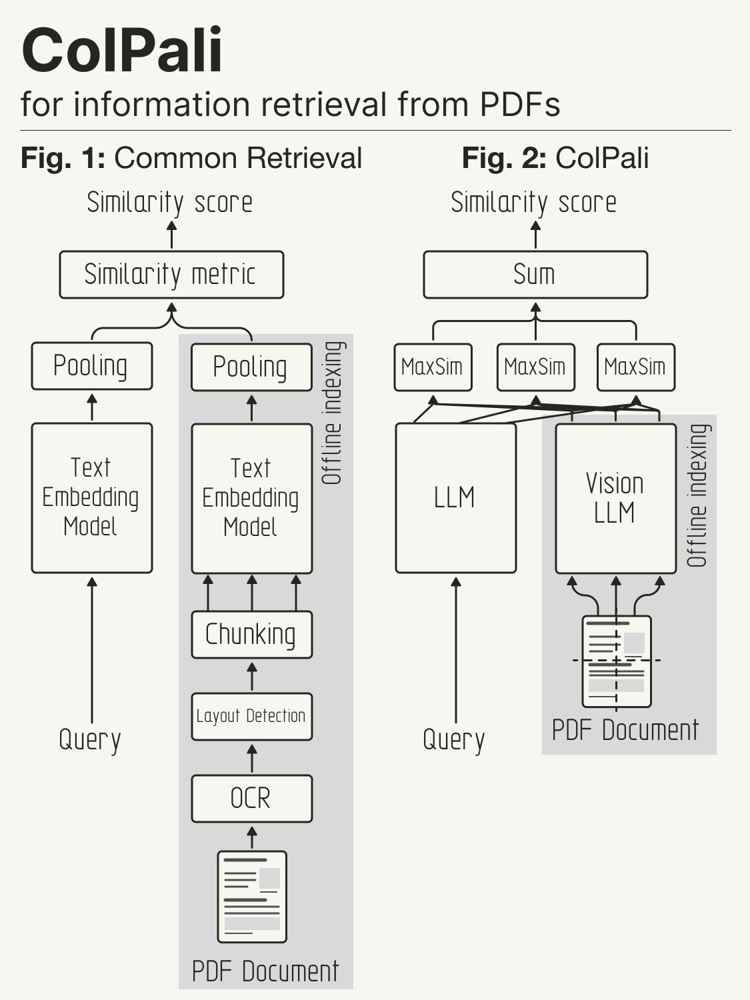
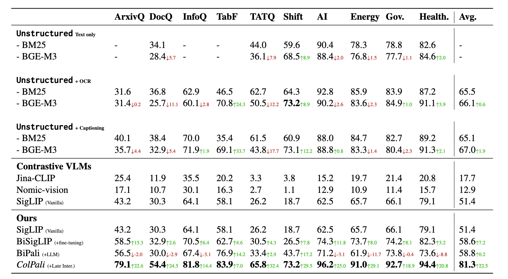

# About

RAG (Retrieval Augmented Generation) is a powerful technique that allows us to enhance LLMs (Language Models) output with private documents and proprietary knowledge that is not available elsewhere. (For example, a company's internal documents or a researcher's notes).

However, it is limited by the quality of the text extraction pipeline. With limited ability to extract visual cues and other non-textual information, RAG can be sub-optimal for documents that are visually rich.

ColiVara uses vision models to generate embeddings for documents, allowing you to retrieve documents based on their visual content.

_From the ColiPali paper:_

> Documents are visually rich structures that convey information through text, as well as tables, figures, page layouts, or fonts. While modern document retrieval systems exhibit strong performance on query-to-text matching, they struggle to exploit visual cues efficiently, hindering their performance on practical document retrieval applications such as Retrieval Augmented Generation.

[Learn More in the ColiPali Paper](https://arxiv.org/abs/2407.01449)

<figure><figcaption>
<em>Credit:</em> <a href="https://x.com/helloiamleonie"><em>helloIamleonie on X</em></a>
</figcaption></figure>

### Key Features

* **State of the Art retrieval**: The API is based on the ColiPali paper and uses the ColQwen2 model for embeddings. It outperforms existing retrieval systems on both quality and latency.
* **User Management**: Multi-user setup with each user having their own collections and documents.
* **Wide Format Support**: Supports over 100 file formats including PDF, DOCX, PPTX, and more.
* **Webpage Support**: Automatically takes a screenshot of webpages and indexes them even if it not a file.
* **Collections**: A user can have multiple collections. For example, a user can have a collection for research papers and another for books. Allowing for efficient retrieval and organization of documents.
* **Documents**: Each collection can have multiple documents with unlimited and user-defined metadata.
* **Filtering**: Filtering for collections and documents on arbitrary metadata fields. For example, you can filter documents by author or year. Or filter collections by type.
* **Convention over Configuration**: The API is designed to be easy to use with opinionated and optimized defaults.
* **Modern PgVector Features**: We use HalfVecs for faster search and reduced storage requirements.
* **REST API**: Easy to use REST API with Swagger documentation.
* **Comprehensive**: Full CRUD operations for documents, collections, and users.
* **Dockerized**: Easy to setup and run with Docker and Docker Compose on your infrastructure.

### Evals:

The ColiPali team has provided the following evals in their paper. We have run quick sanity checks on the API and the Embeddings Service and are getting similar results. We are working on own independent evals and will update this section with our results.

<figure><figcaption></figcaption></figure>

### Components:

1. Postgres DB with pgvector extension for storing embeddings. [ColiVara repo](https://github.com/tjmlabs/ColiVara)
2. REST API for document/collection management. [ColiVara repo.](https://github.com/tjmlabs/ColiVara)
3.  Embeddings Service. This needs a GPU with at least 8gb VRAM. The code is under [`ColiVarE`](https://github.com/tjmlabs/ColiVarE) repo and is optimized for a serverless GPU workload.

    > You can run the embedding service separately and use your own storage and API for the rest of the components. The Embedding service is designed to be modular and can be used with any storage and API. (For example, if you want to use Qdrant for storage and Node for the API)
4.  Language-specific SDKs for the API (Typescript SDK Coming Soon)

    1. Python SDK: [ColiVara-Py](https://github.com/tjmlabs/colivara-py)

### License

This project is licensed under Functional Source License, Version 1.1, Apache 2.0 Future License.&#x20;

For commercial licensing, please contact us at [tjmlabs.com](https://tjmlabs.com). We are happy to work with you to provide a license that meets your needs.
